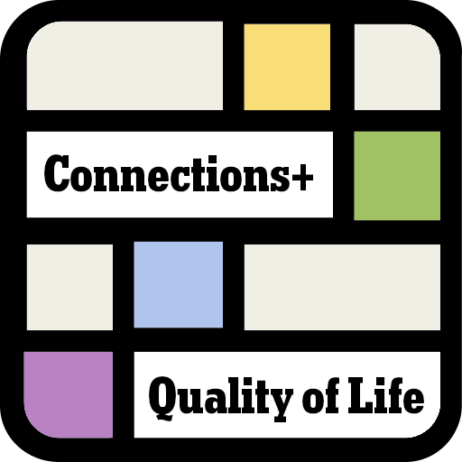

# NYT Connections+ [Quality of Life] Extension
### Available for Chrome & Firefox on Mobile & PC under the [MIT License](https://github.com/RandomGamingDev/NYT-Connections-Quality-of-Life-Extension/blob/main/LICENSE)
  
(Feel free to add whatever you'd like and I welcome new feature requests since I think that Connections is a pretty underrated game :D)

## Settings Icon (Available on Toolbar like in Wordle)

## Settings Options
### All of these are the default settings except for `Dark Theme` which is decided by your default theme
  
### - [Highlighter](https://github.com/RandomGamingDev/NYT-Connections-Quality-of-Life-Extension/new/main?filename=README.md#highlighter)
### - [Tile Dragging](https://github.com/RandomGamingDev/NYT-Connections-Quality-of-Life-Extension/new/main?filename=README.md#tile-dragging)
### - [Dark Theme](https://github.com/RandomGamingDev/NYT-Connections-Quality-of-Life-Extension/new/main?filename=README.md#this-is-just-a-typical-dark-and-light-theme)

## Highlighter
### Click on it to mark a tile as a certain color
On `Desktop` it fades in on hover and on `Mobile` is always present  

## Tile Dragging
### Click and Drag a tile over another in order to swap positions with it

## Dark Theme
### This is just a typical dark and light theme
#### Dark Mode
  
#### Light Mode

